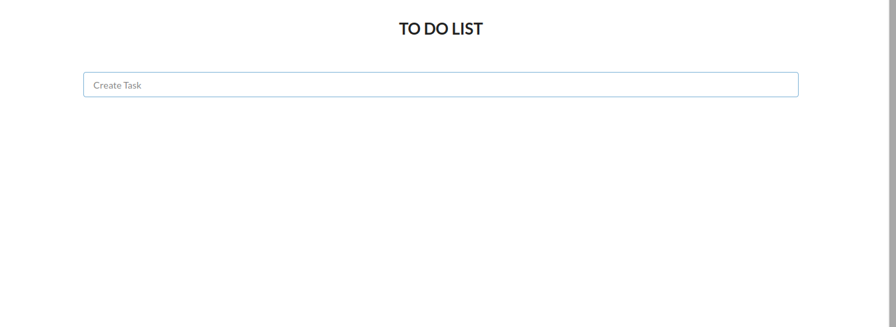
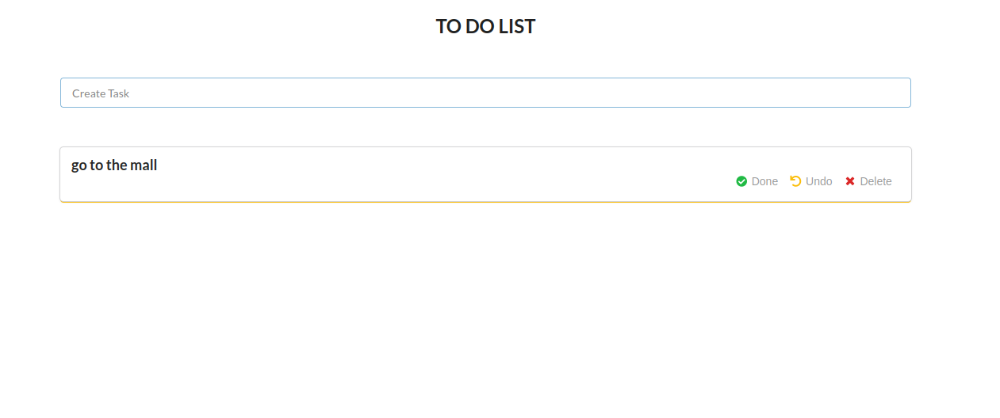
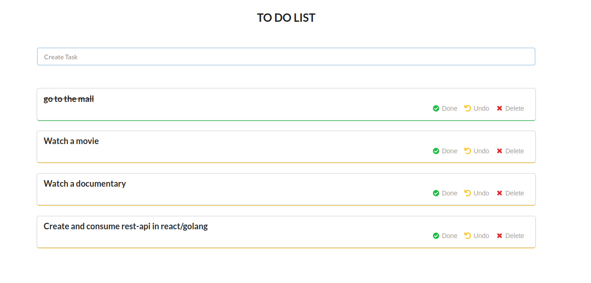

# todo-list
## Screenshots

## Introduction
 This is todolist app.It uses golang as its backend and react.js as client.
## Technologies
- Golang
- Reactjs
- MongoDB
## Setup
- git clone https://github.com/Mugambi645/todo-list
- cd todo-list
~ Listening at http://localhost:3000
## Frontend
- cd client
- npm install
- npm start
## Backend
- cd go-server
- go get
- go run main.go
~ Listening at http://localhost:8080
## MongoDB local setup
- Use [mongodb](https://www.mongodb.com/) guide to learn how to install it in your os
- Create collection and database
- Navigate [go-server] folder eg cd /Documents/golang-todo/go-server && code .
- touch .env
- DB_URI = "Your mongodb url i.e local or atlas"
- DB_NAME = "Your database name"
- DB_COLLECTION_NAME = "Your collection name"

## Development

Want to contribute? Great!

To fix a bug or enhance an existing module, follow these steps:
- Fork the repo
- Create a new branch (git checkout -b improve-feature)
- Make the appropriate changes in the files
- Add changes to reflect the changes made
- Commit your changes (git commit -am 'Improve feature')
- Push to the branch (git push origin improve-feature)
- Create a Pull Request

